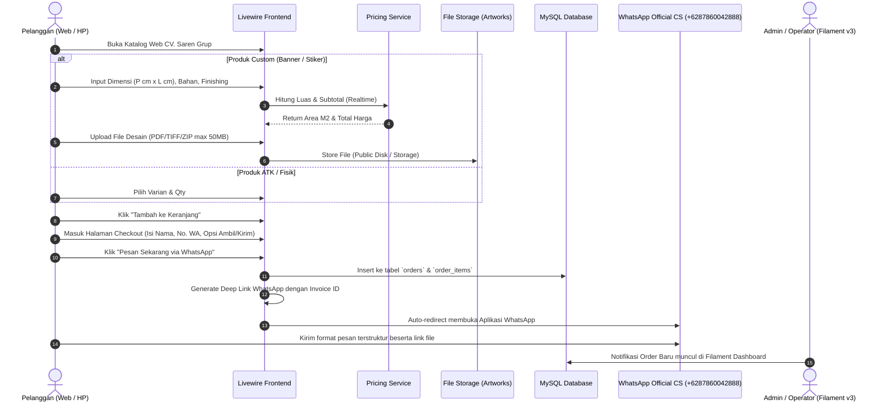
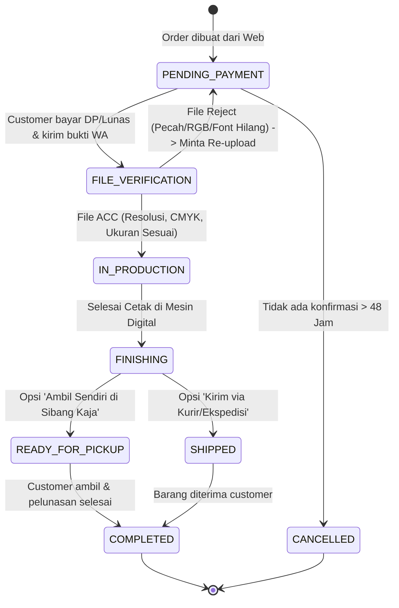

# WORKFLOWS & OPERATIONAL RUNBOOKS
# CV. Saren Grup Percetakan Digital

---

## 1. End-to-End Customer Journey Workflow

---

## 2. Order Fulfillment & Production State Machine

### Penjelasan Status & Trigger:
1. **`PENDING_PAYMENT` (Menunggu Pembayaran)**:
   - Status awal saat pesanan tersimpan di web dan WhatsApp terkirim.
   - Admin mengecek mutasi rekening atau kesepakatan DP (50% untuk B2C, opsi termin untuk B2B mitra).
2. **`FILE_VERIFICATION` (Verifikasi File Desain)**:
   - Operator grafis mengecek file cetak yang diupload.
   - Melakukan preflight check (skala 1:1, CMYK mode, resolusi minimal 150 DPI untuk banner atau 300 DPI untuk kartu/stiker).
3. **`IN_PRODUCTION` (Proses Cetak)**:
   - File dikirim ke software RIP mesin cetak (Large Format Printer / Mesin Digital Press).
   - Mesin melakukan *running print*.
4. **`FINISHING` (Finishing & Quality Control)**:
   - Pekerjaan manual pasca cetak: Pasang mata ayam, kelim lipat pres, selongsong, laminasi doff/glossy, potong die-cut/kiss-cut, perakitan jam dinding, packing kartu nama.
5. **`READY_FOR_PICKUP` (Siap Diambil)**:
   - Produk sudah selesai di-packing dan diletakkan di rak pickup workshop Sibang Kaja.
   - Notifikasi otomatis dikirim ke WhatsApp customer.
6. **`SHIPPED` (Dalam Pengiriman)**:
   - Produk diserahkan ke kurir internal atau ekspedisi (Grab/Gojek/JNE/J&T). Resi diinput di Filament.
7. **`COMPLETED` (Selesai)**:
   - Transaksi tuntas secara administratif dan barang sudah diterima customer.
8. **`CANCELLED` (Dibatalkan)**:
   - Pesanan dibatalkan atas permintaan customer atau kadaluarsa pembayaran.

---

## 3. Operator Preflight Inspection Checklist (SOP Grafis)

Sebelum file dilempar ke mesin cetak, operator grafis di CV. Saren Grup wajib memastikan:

| Jenis Produk | Resolusi Minimal | Color Space | Safe Margin & Bleed | Format File Ideal |
| :--- | :---: | :---: | :--- | :--- |
| **Banner Outdoor (Flex China/Korea)** | 100 - 150 DPI | CMYK | Bleed 3 cm keliling untuk lipatan kelim/mata ayam | TIFF (LZW compression), PDF, JPG High |
| **Stiker Print & Cut (Vinyl/Bontax)** | 300 DPI | CMYK | Bleed 2 mm, sediakan layer khusus garis potong (CutContour) vektor | PDF, AI, CDR, EPS |
| **Kartu Nama (Art Paper 260/310)** | 300 DPI | CMYK | Ukuran file $9.4 \times 5.9\text{ cm}$ (safe text $8.6 \times 5.1\text{ cm}$) | PDF X-1a, CorelDraw (Convert to Curves) |
| **Undangan & Brosur** | 300 DPI | CMYK | Bleed 3 mm keliling | PDF, PSD (Flattened) |
| **Payung Sablon** | Vektor murni | Monokrom/Spot Color | Desain dibatasi area sablon $20 \times 15\text{ cm}$ per panel | AI, CDR, SVG, PDF Vektor |
| **Jam Dinding Custom** | 300 DPI | CMYK | Desain lingkaran diameter 25.5 cm (termasuk 0.5 cm bleed tepi) | TIFF, PNG Transparan, PSD |

---

## 4. Admin Filament Order Management Workflow

1. **Memantau Antrean Pesanan**:
   - Admin login ke `/admin`.
   - Masuk ke menu **Percetakan & Penjualan -> Orders**.
   - Table menampilkan filter tab: `Semua`, `Perlu Verifikasi`, `Sedang Diproduksi`, `Siap Diambil`.
2. **Review & Download File Artwork**:
   - Klik aksi **Lihat / Detail** pada row pesanan.
   - Infolist menampilkan preview gambar, dimensi, rincian biaya, dan direct link download file resolusi asli.
3. **Mengirim Notifikasi WhatsApp Sekali Klik**:
   - Pada tabel atau form edit, klik tombol aksi **"Hubungi Customer WA"** atau **"Kirim Update Status"**.
   - Sistem auto-generate URL `wa.me` dengan teks dinamis sesuai status pesanan saat ini (misal: "Barang Anda sudah siap diambil di workshop Sibang Kaja").
